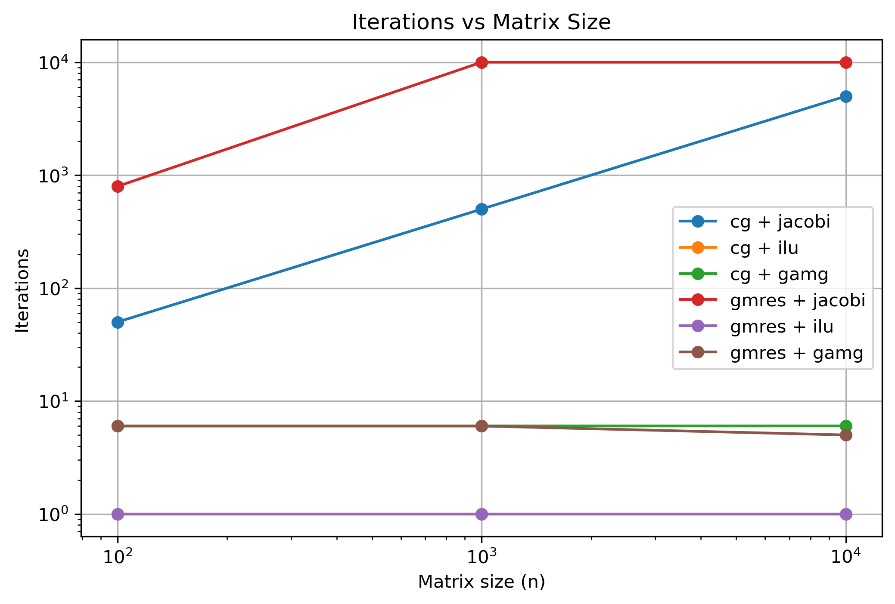
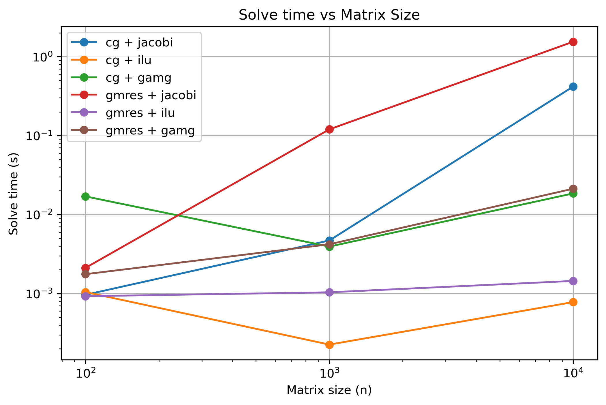

# Phase 1 – PETSc Fundamentals

## Introduction

The objective of this phase was to become familiar with the core PETSc
abstractions and establish a basic benchmarking workflow.

Rather than immediately solving complex PDEs, the focus was placed on
understanding PETSc's linear algebra and solver infrastructure:

- Vec
- Mat
- KSP
- PC
- PETSc Options Database

The goal was to develop a minimal but extensible benchmark framework
capable of comparing different solver and preconditioner combinations.

---

## Implementation

A small C++ application was developed using PETSc and CMake.

The benchmark constructs a sparse tridiagonal matrix corresponding to
the one-dimensional Poisson operator

A = tridiag(-1, 2, -1)

with a constant right-hand side vector.

The matrix size can be configured at runtime through PETSc's options
database.

Benchmark results are stored in a `BenchmarkResult` structure and
exported as JSON for automated post-processing.

A Python script was created to:

1. Execute benchmark campaigns.
2. Sweep over matrix sizes.
3. Compare different KSP and PC configurations.
4. Collect results.
5. Generate plots automatically.

---

## Benchmark Setup

### Krylov Solvers

- CG
- GMRES

### Preconditioners

- Jacobi
- ILU
- GAMG

### Matrix Sizes

- 100
- 1,000
- 10,000

### Metrics

- Iteration count
- Solve time
- Convergence status
- Final residual

---

## Results

### Iteration Counts

CG with Jacobi required approximately n/2 iterations for all
tested matrix sizes.

CG with GAMG required approximately six iterations
independent of matrix size.

This demonstrates the mesh-independent convergence
characteristic of algebraic multigrid methods.

ILU preconditioning reduced the iteration count to a single
iteration for the tested 1D Poisson problem.

GMRES with Jacobi performed poorly and failed to converge
within the maximum iteration limit for larger systems.

## Key Lessons

1. Krylov method selection matters.
2. Preconditioner selection matters even more.
3. GAMG provides mesh-independent convergence.
4. Benchmarking should record convergence status in addition to iteration counts.
5. Iteration count and runtime are related but distinct metrics.
